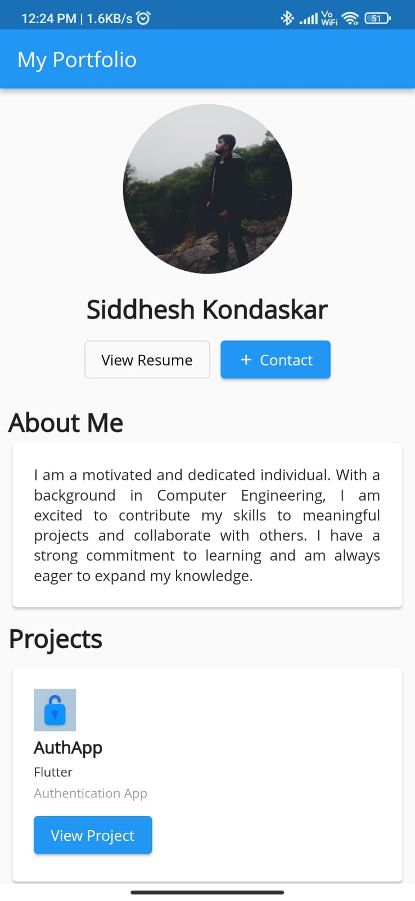
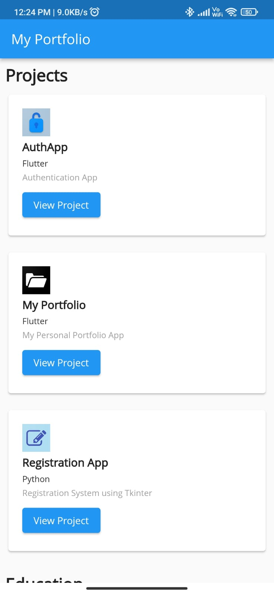
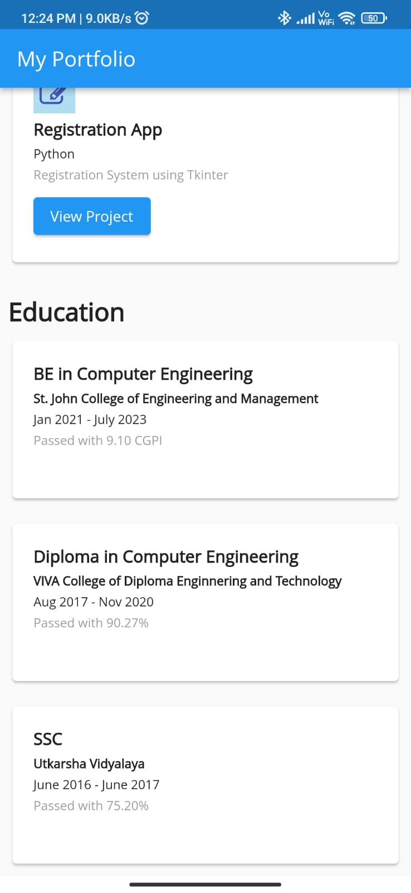

# My Portfolio App

This is a Flutter app that showcases my portfolio.

## Features

- Responsive layout: The app adapts to different screen sizes, ensuring a seamless experience across devices.
- Project showcase: Display your projects with project name, technology stack, and a button to redirect to the corresponding GitHub repository.
- Education section: Highlight your educational background with details such as degree, university, duration, and any notable achievements.
- Interactive resume: Provide a link to view your resume and allow visitors to easily contact you via email.

## Installation

To run the app locally, follow these steps:

1. Clone the repository
2. Navigate to the project directory: `cd project-directory`
3. Install dependencies: `flutter pub get`
4. Run the app: `flutter run`

## Screenshots

  
  
  

